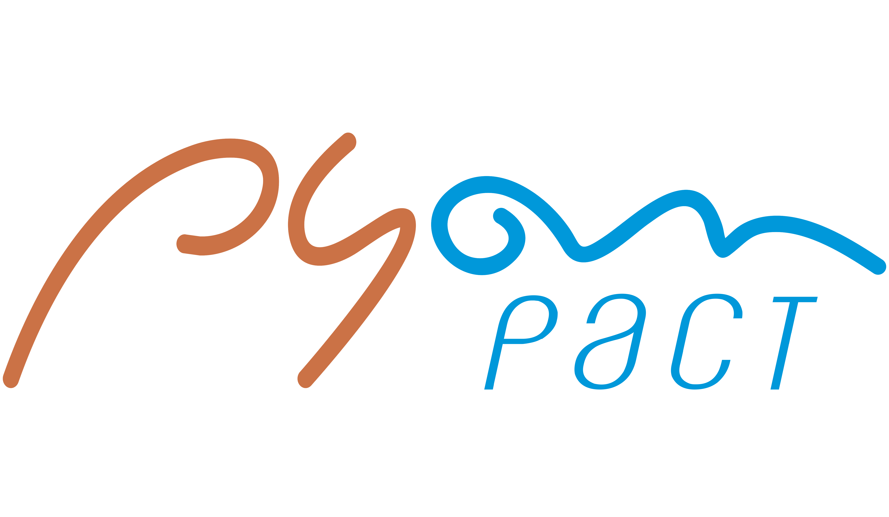

# pyon-pactman-contract-testing
PYON-PACTMAN | Pact-based Contract Testing in Python-Pactman

Pyon Contract Testing Automation project is available to implement API tests with the following stacks and approaches:

- Programming Language: [Python-based](https://www.python.org/downloads/).
- Minimal library requirements: [Pactman](https://pypi.org/project/pactman/)

To know how you can configure your environment to implement and execute this project locally or even remotely, follow all the instructions from this documentation. So, let's start with it and good luck!

## CLONING THE PROJECT FROM GITHUB

Go to [GITHUB](https://github.com/hudsonssrosa/pyon-behave-ui-tests-web) and **CLONE** the project using **GIT** (download and install GIT from [here](https://git-scm.com/downloads))

In you local machine, choose you local repository and clone the project using SSH for Mac OS or Linux platforms with this command:

```bash
    git clone git@github.com:hudsonssrosa/pyon-pactman-contract-testing.git
```

If you are having issues when cloning or pushing to the repository make sure you have all your SSH keys in place. Click [here](https://help.github.com/en/github/authenticating-to-github/connecting-to-github-with-ssh) for more information about it.

## PREPARING YOUR ENVIRONMENT

### 1. Install Python

Download and install the [latest Python](https://www.python.org/downloads/) version (3.8 or over). Then, in any terminal, try this command to check if Python is correctly installed:

```bash
      python
```

### 2. Choose a good IDE

Once you have opened the project in an IDE of your preference (suggestion: install [Visual Studio Code](https://code.visualstudio.com/download) or [PyCharm CE](https://www.jetbrains.com/pycharm/)), then you will need to *set the Python interpreter* for the project.

After this, you are able to create the *Python Virtual Environment* for the PYON project and install all the requirements needed (libraries/packages). You just need to run for the first time the `update.py` and then the virtual environment as well the libraries in `requirements.txt` will be automatically installed for you.

- In Windows:

```bash
      python update.py
```

- In MacOSX or Linux:

```bash
      python3 update.py
```

### 3. Dockerize the project

At some point you will need to execute the tests from your local machine to simulate the environment like in a continuous integration server (with all requirements installed and configured properly - OS, Python, PYON and execution of tests in a specific server).
Install [Docker](https://www.docker.com/get-started), check if it is working for PYON and execute the `docker-compose` file with this command line:

```bash
    docker-compose run --rm web
 ```
